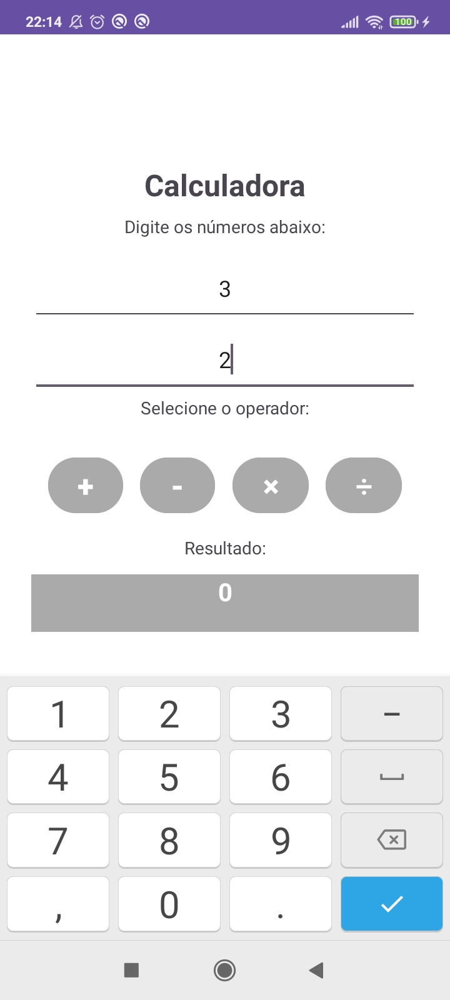
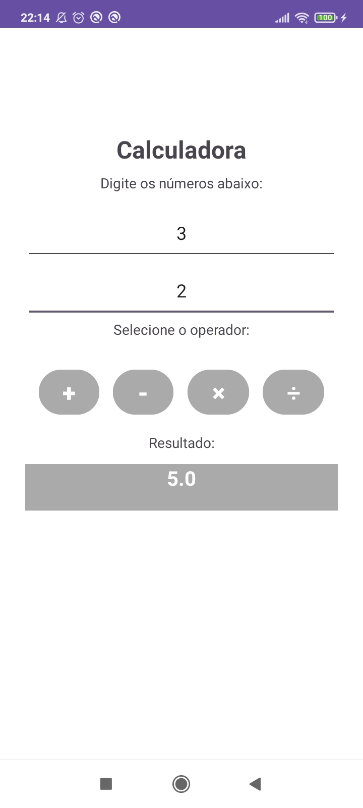

# CalculadoraAndroid
Trabalho final da disciplina "Programação para Dispositivos Móveis" do curso de Análise e Desenvolvimento de Sistemas.

Atividade proposta: Desenvolver um app que implemente uma calculadora com operações básicas utilizando o Android Studio com a escolha livre da linguagem de programação. As operações básicas são: adição, subtração, multiplicação e divisão. Não há necessidade de armazenamento dos resultados (memória).

Resultado:

  
